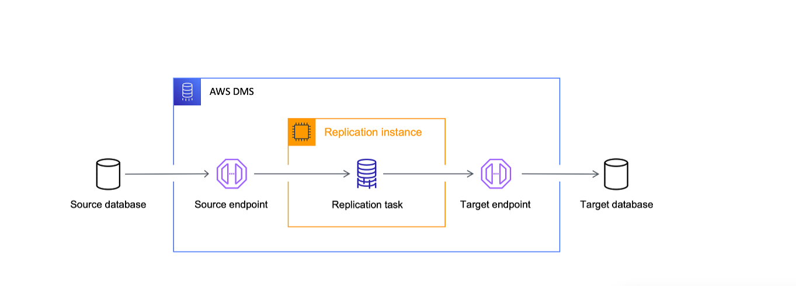

# MySQL Database Migration from EC2 to RDS using AWS DMS 
## Project Overview
This project demonstrates migrating a **MySQL database hosted on an EC2 instance** to an **RDS MySQL database** using **AWS Database Migration Service (DMS)**.  

##  Objectives

-  **Migrate** the `librarydb` database from an EC2-hosted MySQL instance to Amazon RDS MySQL.  
- **Ensure minimal downtime** while transferring all application tables (`Authors`, `Books`, `Members`).  
-  **Validate data integrity** after migration using row counts, table validation, and checksums.  
-  **Monitor and troubleshoot** any errors or warnings during migration using AWS DMS and CloudWatch Logs.  
- **Securely handle system tables** by ignoring irrelevant warnings while focusing on application data.  
-  **Provide a repeatable migration process** that can serve as a reference for future database migrations.

---

##  Architecture



## Pre-requisites  

Before starting the migration, ensure you have the following:  

1.  **AWS Account** with admin access  
2.  **EC2 Instance** with MySQL installed and accessible  
3. **RDS MySQL Instance** (`db.t4g.micro` or any small instance)  
4.  **Default VPC** and **default subnets**  
5.  **IAM Role for DMS** (`DMSS3AccessRole-ec2-rds-via-dms`) to access S3  
6.  **S3 Bucket** (`ec2-rds-via-dms`) to store assessment reports  
7.  **MySQL Client** installed locally or on EC2 to test connectivity  

## Step 1: Setup Source Database on EC2  

### Connect & Install MySQL  
```bash
# SSH into EC2
ssh -i your-key.pem ubuntu@<EC2-Public-IP>

# Update & Upgrade
sudo apt update && sudo apt upgrade -y

# Install MySQL
sudo apt install mysql-server -y

# Secure MySQL
sudo mysql_secure_installation
```

### Login & Create Database with Dummy Data  

```bash
# Login to MySQL
sudo mysql -u root -p
enter password
```

### Paste SQL script inside MySQL prompt:
###  Load SQL Script  

The SQL script for creating tables and populating dummy data is available in this repo:  

[librarydb.sql](./librarydb.sql)  

Run it directly from the shell:  

```bash
mysql -u root -p < librarydb.sql
```
###  Verify Data  

```bash
# Check databases   
SHOW DATABASES;
# Use the librarydb database
USE librarydb;
# Check tables
SHOW TABLES;
# Check data in  table
SELECT COUNT(*) AS authors FROM Authors;
SELECT COUNT(*) AS books FROM Books;
SELECT COUNT(*) AS members FROM Members;
```
 **Expected Output:**  
- Authors → `100`  
- Books → `1000`  
- Members → `10000`
---

##  Step 2: Setup Target Database (RDS)  

###  Create RDS Instance  
- Go to **AWS Console → RDS → Databases → Create Database**  
-  **Engine**: MySQL Community  
-  **Instance type**: `db.t4g.micro` (free tier eligible)  
-  **Storage**: Default  
-  **Public accessibility**: Yes  
-  **VPC & Subnets**: Use **default VPC** (same as EC2 project)  

---

###  Configure Authentication  
-  Set **Master username** (e.g., `admin`)  
-  Set **Master password**  

---

###  Networking & Security  
-  Security Group: Allow inbound **MySQL (3306)** from:  
  - Your **IP** (if connecting locally), OR  
  - **EC2 Security Group** (if connecting from EC2)  

---

###  Create Database  
- Click **Create Database**  
- Wait until status =  **Available**  


---

##  Step 3: Create S3 Bucket for DMS Assessment  

###  Create Bucket  
-  Go to **AWS Console → S3 → Create bucket**  
-  **Bucket name**: `ec2-rds-via-dms`  
-  **Region**: `us-east-1`  
-  **Object ownership**: Bucket owner enforced  
-  **Block Public Access**: Enabled (block all public access = Yes)  
-  **Encryption**: Enable **SSE-S3 (default)**  

---

###  Confirm  
-  Click **Create Bucket**  
-  Bucket ready to store **DMS assessment reports**  
---
##  Step 4: Create DMS Replication Instance  

###  Create Replication Instance  
-  Go to **AWS Console → DMS → Replication instances → Create replication instance**  
-  **Name**: `mysql-ec2-to-rds`  
- **Instance class**: `dms.t3.small` (or `dms.t3.medium` for higher load)  
-  **Storage**: Default  
-  **Multi-AZ**: No (for testing; use Yes in production)  
-  **Publicly accessible**: Yes  
-  **VPC & Subnets**: Use **default VPC & subnets** (same as EC2 & RDS setup)  

---

###  Networking & Security  
- Ensure **DMS replication instance Security Group (SG)** can connect to:  
  - **EC2 MySQL** → Port `3306`  
  -  **RDS MySQL** → Port `3306`  

---

###  Create Instance  
- Click **Create replication instance**  
- Wait until status = **Available**  


---
## Step 5: Create Source Endpoint (EC2 MySQL)  

###  Create Endpoint  
-  Go to **AWS Console → DMS → Endpoints → Create endpoint**  
-  **Endpoint type**: Source  
-  **Engine**: MySQL  
---

###  Configure Connection  
-  **Server name**: EC2 **Public or Private IP** (use private IP if within same VPC)  
-  **Port**: `3306`  
-  **Username / Password**: MySQL admin credentials (set during MySQL install)  

---

###  Test Connection  
-  Ensure **EC2 Security Group** allows inbound **3306** from the **DMS Replication Instance SG**  
-  Click **Test endpoint connection** → should return **Success**  
---

-  **Port**: `3306`  
-  **Username / Password**: RDS admin credentials (set during RDS setup)  

---

###  Test Connection  
-  Ensure **RDS Security Group** allows inbound **3306** from the **DMS Replication Instance SG**  
-  Click **Test endpoint connection** → should return **Success**  


---
##  Step 6: Create Target Endpoint (RDS MySQL)

### Create Endpoint
-  Go to **DMS → Endpoints → Create endpoint**  
-  **Endpoint type**: Target  
-  **Engine**: MySQL  

---

###  Configure Connection
-  **Server name**: RDS endpoint  
  `migrationrds.cw1s28c2cvd9.us-east-1.rds.amazonaws.com`  
-  **Port**: 3306  
-  **Username / Password**: RDS admin credentials (set during RDS setup)  

---

###  Test Connection
-  Ensure **RDS Security Group** allows inbound 3306 from the DMS Replication Instance SG  
-  Click **Test endpoint connection** → should return **Success**


---

##  Step 7: Pre-Migration Assessment  

###  Create Assessment  
-  Go to **AWS Console → DMS → Assessment → Create premigration assessment**  
-  **S3 bucket**: `s3://ec2-rds-via-dms`  
-  **IAM Role**: `DMSS3AccessRole-ec2-rds-via-dms`  

---

###  Select Assessments  
-  **Foreign keys**  
-  **Invisible columns**  
-  **Storage engine check**  

---

###  Run Assessment  
-  Start the assessment task  
- Once complete, reports will be available in the specified **S3 bucket**  
---

##  Step 8: Create DMS Migration Task

###  Create Migration Task
-  Go to **AWS Console → DMS → Database migration tasks → Create task**  
-  **Task name**: `mysql-ec2-to-rds`  
- **Source endpoint**: `mysql-source` (EC2 MySQL)  
-  **Target endpoint**: `mysql-target` (RDS MySQL)  
-  **Migration type**: Full load  

---

###  Configure Table Mappings
-  **Select database**: `librarydb`  
-  **Include all tables**: `Authors`, `Books`, `Members`  

---

### Run Migration Task
- **Start migration task**  
-  **Monitor progress**: DMS Console → Tasks → Table statistics  

---


###  Notes
-  You may see warnings/errors related to system tables → **ignore these**  
-  Focus only on your **application database**: `librarydb`


---
##  Step 9: Verify Data in RDS

###  Login to RDS
```bash
mysql -h <RDS-ENDPOINT> -u admin -p
```

###  Switch to Database
```bash
USE librarydb;
```
###  Check Row Counts
```bash
SELECT COUNT(*) AS authors FROM Authors;
SELECT COUNT(*) AS books FROM Books;
SELECT COUNT(*) AS members FROM Members;
```
###  Expected Results
- Authors → `100`
- Books → `1000`
- Members → `10000`


---

## Step 10: Validation & Final Output

###  Enable DMS Table Validation
-  Go to **DMS → Migration tasks → Enable table validation**  
-  Confirms row counts & checksums between EC2 MySQL and RDS MySQL  

---

###  Monitor Logs
-  Use **CloudWatch Logs** to troubleshoot any migration errors/warnings  

---

###  System Tables Errors
-  Ignore errors for MySQL system tables (e.g., `mysql.*`, `performance_schema.*`)  
-  These are internal and **not required for migration**  

---

###  Final Output
-  Database `librarydb` migrated successfully  
-  Tables: `Authors`, `Books`, `Members`  
-  Full load progress: 100%  
-  Data verified in RDS via MySQL client or tools like MySQL Workbench  

Migration is complete 🎉


##  Conclusion

-  The migration of `librarydb` from EC2 MySQL to RDS MySQL using AWS DMS was successfully completed.  
-  All application tables (`Authors`, `Books`, `Members`) were fully migrated and validated.  
-  Row counts and data integrity were confirmed using table validation and manual checks.  
-  Any warnings or errors related to system tables were safely ignored as they do not impact the application data.  

 **Happy Migration! Your database is now running smoothly on RDS!**
